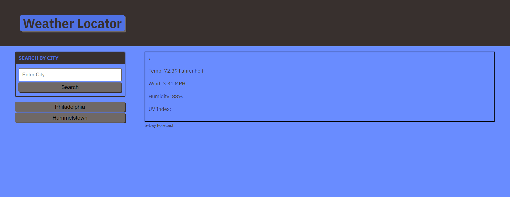

# Weather-Locator

To tell a user what the current and 5 day weather are given an input of a city name

## Criteria

* Upon search of a city, current and future weather displayed and city added to search history

* Weather stats tell me the temp, hhumidity, wind speed, and UV index

* UV index indicated favorable, moderate, or severe conditions

* 5-day weather displays the date, icon of the weather, temp, wind, and humidity

* Search history allows user to easily see weather for cities previously searched

## Website

https://northernpines.github.io/Weather-Locator/

